# Mapa de Dependências — SIFAP Legado

> **Trilha:** [Kit do Time](../README.md) › [Estágio 1](README.md) › **Mapa de Dependências**

**Artefato preenchido pelo time durante o Estágio 1 — Passo 3.** Registra as dependências entre programas Natural e DDMs Adabas que sustentam o escopo selecionado.

| Campo                  | Valor                                                               |
| ---------------------- | ------------------------------------------------------------------- |
| **Público-alvo**       | Todas as duplas, com liderança da Dupla 2 (Arquitetura)             |
| **Pré-requisitos**     | Catálogo de regras com as origens identificadas                     |
| **Estágio**            | Estágio 1 — Arqueologia                                             |
| **Resultado esperado** | Diagrama Mermaid e tabelas de arestas com evidência `arquivo:linha` |

> [!IMPORTANT]
> Mapeie apenas as dependências que explicam o escopo selecionado: programas `.NSN` que chamam outros programas (`CALLNAT`, `FETCH`) e programas que acessam DDMs (`READ`, `FIND`, `STORE`, `UPDATE`, `DELETE`). Toda aresta precisa estar apoiada em `arquivo:linha` — nenhuma inferência sem evidência. Este mapa alimenta as hipóteses de fatiamento em [`discovery-report.md`](discovery-report.md).

> [!NOTE]
> Guia passo a passo: [`GUIDE.md`](GUIDE.md).

**Time**: `Franklyn`
**Escopo**: `01-archaeology/legacy-sifap/natural-programs/` — os 24 membros da biblioteca, com rastreamento recursivo
**Data**: 2026-09-10

> [!NOTE]
> O diagrama também está isolado em [`dependency-map.mmd`](dependency-map.mmd), para renderização fora deste documento.

---

## Diagrama Mermaid

```mermaid
%%{init: {'theme':'neutral','themeVariables':{'fontFamily':'ui-sans-serif, system-ui, sans-serif','primaryColor':'#F5F5F5','primaryTextColor':'#171717','primaryBorderColor':'#171717','lineColor':'#525252','secondaryColor':'#FFFFFF','tertiaryColor':'#FAFAFA','background':'#FFFFFF'}}}%%
flowchart TD
    classDef job fill:#FAFAFA,stroke:#A3A3A3,color:#404040
    classDef prog fill:#F5F5F5,stroke:#171717,color:#171717
    classDef sub fill:#FFFFFF,stroke:#525252,color:#171717
    classDef area fill:#FAFAFA,stroke:#A3A3A3,color:#404040
    classDef data fill:#FFFFFF,stroke:#171717,color:#171717,stroke-width:2px

    SIFAPJ01["SIFAPJ01.jcl"]
    SIFAPJ02["SIFAPJ02.jcl"]

    BATCHPGT["BATCHPGT"]
    BATCHREL["BATCHREL"]
    BATCHCON["BATCHCON"]
    CADBENEF["CADBENEF"]
    CADDEPEN["CADDEPEN"]
    CADPROG["CADPROG"]
    CALCCORR["CALCCORR"]
    CALCDSCT["CALCDSCT"]
    CONSBENF["CONSBENF"]
    RELPGT["RELPGT"]
    RELAUDIT["RELAUDIT"]
    VALDOCS["VALDOCS"]

    CALCBENF["CALCBENF"]
    VALELEG["VALELEG"]
    VALBENEF["VALBENEF"]
    SUBVALCP["SUBVALCP"]
    SUBVALNI["SUBVALNI"]

    CCAUDIT["CCAUDIT"]
    CCVALCPF["CCVALCPF"]
    PDACALC["PDACALC"]
    PDAVALID["PDAVALID"]

    BENEFIC[("BENEFIC / 150")]
    SOCPROG[("SOCPROG / 151")]
    AUDIT[("AUDIT / 153")]
    PAYMENT[("PAYMENT")]

    SIFAPJ01 -->|"STEP010"| BATCHPGT
    SIFAPJ02 -->|"STEP010"| BATCHREL
    SIFAPJ02 -->|"STEP020"| RELPGT

    BATCHPGT -->|"CALLNAT"| SUBVALCP
    BATCHPGT -->|"CALLNAT"| VALELEG
    BATCHPGT -->|"CALLNAT"| CALCBENF
    CADBENEF -->|"CALLNAT"| SUBVALCP
    CADBENEF -->|"CALLNAT"| SUBVALNI
    CADBENEF -->|"CALLNAT"| VALBENEF
    CALCCORR -->|"CALLNAT"| SUBVALCP
    CONSBENF -->|"CALLNAT"| SUBVALCP
    VALDOCS  -->|"CALLNAT"| SUBVALNI

    BATCHCON -.->|"INCLUDE"| CCAUDIT
    BATCHPGT -.->|"INCLUDE"| CCAUDIT
    CADBENEF -.->|"INCLUDE"| CCAUDIT
    CADDEPEN -.->|"INCLUDE"| CCAUDIT
    CADPROG  -.->|"INCLUDE"| CCAUDIT
    CALCCORR -.->|"INCLUDE"| CCAUDIT
    CONSBENF -.->|"INCLUDE"| CCAUDIT
    CADDEPEN -.->|"INCLUDE"| CCVALCPF
    SUBVALCP -.->|"INCLUDE"| CCVALCPF

    BATCHPGT -.->|"USING"| PDACALC
    CALCBENF -.->|"USING"| PDACALC
    VALELEG  -.->|"USING"| PDACALC
    BATCHPGT -.->|"USING"| PDAVALID
    CADBENEF -.->|"USING"| PDAVALID
    CALCCORR -.->|"USING"| PDAVALID
    CONSBENF -.->|"USING"| PDAVALID
    VALDOCS  -.->|"USING"| PDAVALID
    SUBVALCP -.->|"USING"| PDAVALID
    SUBVALNI -.->|"USING"| PDAVALID

    CADBENEF -->|"FIND / STORE / UPDATE"| BENEFIC
    CADDEPEN -->|"FIND / UPDATE"| BENEFIC
    BATCHPGT -->|"READ"| BENEFIC
    BATCHREL -->|"FIND"| BENEFIC
    CALCBENF -->|"FIND"| BENEFIC
    CALCDSCT -->|"FIND"| BENEFIC
    CONSBENF -->|"FIND"| BENEFIC
    RELPGT   -->|"FIND"| BENEFIC
    VALELEG  -->|"FIND"| BENEFIC

    CADPROG  -->|"FIND / STORE"| SOCPROG
    BATCHPGT -->|"FIND"| SOCPROG
    CALCBENF -->|"FIND"| SOCPROG
    VALELEG  -->|"FIND"| SOCPROG

    BATCHPGT -->|"READ / FIND NUMBER / STORE"| PAYMENT
    CALCBENF -->|"STORE"| PAYMENT
    BATCHCON -->|"FIND / UPDATE"| PAYMENT
    CALCCORR -->|"READ / UPDATE"| PAYMENT
    CALCDSCT -->|"FIND / UPDATE"| PAYMENT
    BATCHREL -->|"READ"| PAYMENT
    CONSBENF -->|"READ"| PAYMENT
    RELPGT   -->|"READ"| PAYMENT

    CCAUDIT  -->|"READ / STORE"| AUDIT
    BATCHCON -->|"READ / STORE"| AUDIT
    RELAUDIT -->|"READ / HISTOGRAM"| AUDIT

    class SIFAPJ01,SIFAPJ02 job
    class BATCHPGT,BATCHREL,BATCHCON,CADBENEF,CADDEPEN,CADPROG,CALCCORR,CALCDSCT,CONSBENF,RELPGT,RELAUDIT,VALDOCS prog
    class CALCBENF,VALELEG,VALBENEF,SUBVALCP,SUBVALNI sub
    class CCAUDIT,CCVALCPF,PDACALC,PDAVALID area
    class BENEFIC,SOCPROG,AUDIT,PAYMENT data
```



> [!NOTE]
> As 13 arestas `USING LDASIFAP` foram omitidas do diagrama para preservar a legibilidade e estão tabuladas na íntegra na seção de áreas de dados. O arquivo [`dependency-map.mmd`](dependency-map.mmd) as inclui.

---

## Arestas JCL → Programa

| #   | Job        | Step    | Programa   | Evidência (`arquivo:linha`)            |
| --- | ---------- | ------- | ---------- | -------------------------------------- |
| 1   | `SIFAPJ01` | STEP010 | `BATCHPGT` | `SIFAPJ01.jcl:L46`, `SIFAPJ01.jcl:L71` |
| 2   | `SIFAPJ02` | STEP010 | `BATCHREL` | `SIFAPJ02.jcl:L49`, `SIFAPJ02.jcl:L68` |
| 3   | `SIFAPJ02` | STEP020 | `RELPGT`   | `SIFAPJ02.jcl:L77`, `SIFAPJ02.jcl:L96` |

**Três dos quinze programas atribuídos são agendados.** Os outros doze são transações online ou execuções manuais.

---

## Arestas Programa → Programa

| #   | De         | Para       | Tipo      | Evidência (`arquivo:linha`) |
| --- | ---------- | ---------- | --------- | --------------------------- |
| 1   | `BATCHPGT` | `SUBVALCP` | `CALLNAT` | `BATCHPGT.NSP:L276`         |
| 2   | `BATCHPGT` | `VALELEG`  | `CALLNAT` | `BATCHPGT.NSP:L369`         |
| 3   | `BATCHPGT` | `CALCBENF` | `CALLNAT` | `BATCHPGT.NSP:L381`         |
| 4   | `CADBENEF` | `SUBVALCP` | `CALLNAT` | `CADBENEF.NSP:L161`         |
| 5   | `CADBENEF` | `SUBVALNI` | `CALLNAT` | `CADBENEF.NSP:L196`         |
| 6   | `CADBENEF` | `VALBENEF` | `CALLNAT` | `CADBENEF.NSP:L263`         |
| 7   | `CALCCORR` | `SUBVALCP` | `CALLNAT` | `CALCCORR.NSP:L160`         |
| 8   | `CONSBENF` | `SUBVALCP` | `CALLNAT` | `CONSBENF.NSP:L136`         |
| 9   | `VALDOCS`  | `SUBVALNI` | `CALLNAT` | `VALDOCS.NSP:L109`          |

**Nove arestas `CALLNAT` em toda a biblioteca.** Todos os destinos existem; não há referência quebrada.

---

## Arestas Programa → Copycode (`INCLUDE`)

| #   | Programa   | Copycode   | Evidência (`arquivo:linha`) |
| --- | ---------- | ---------- | --------------------------- |
| 1   | `BATCHCON` | `CCAUDIT`  | `BATCHCON.NSP:L345`         |
| 2   | `BATCHPGT` | `CCAUDIT`  | `BATCHPGT.NSP:L594`         |
| 3   | `CADBENEF` | `CCAUDIT`  | `CADBENEF.NSP:L418`         |
| 4   | `CADDEPEN` | `CCAUDIT`  | `CADDEPEN.NSP:L235`         |
| 5   | `CADPROG`  | `CCAUDIT`  | `CADPROG.NSP:L176`          |
| 6   | `CALCCORR` | `CCAUDIT`  | `CALCCORR.NSP:L243`         |
| 7   | `CONSBENF` | `CCAUDIT`  | `CONSBENF.NSP:L314`         |
| 8   | `CADDEPEN` | `CCVALCPF` | `CADDEPEN.NSP:L230`         |
| 9   | `SUBVALCP` | `CCVALCPF` | `SUBVALCP.NSN:L94`          |

---

## Arestas Programa → Área de dados (`USING`)

| #   | Programa   | Área       | Tipo      | Evidência (`arquivo:linha`) |
| --- | ---------- | ---------- | --------- | --------------------------- |
| 1   | `BATCHPGT` | `PDACALC`  | LOCAL     | `BATCHPGT.NSP:L29`          |
| 2   | `CALCBENF` | `PDACALC`  | PARAMETER | `CALCBENF.NSN:L17`          |
| 3   | `VALELEG`  | `PDACALC`  | PARAMETER | `VALELEG.NSN:L16`           |
| 4   | `BATCHPGT` | `PDAVALID` | LOCAL     | `BATCHPGT.NSP:L28`          |
| 5   | `CADBENEF` | `PDAVALID` | LOCAL     | `CADBENEF.NSP:L14`          |
| 6   | `CALCCORR` | `PDAVALID` | LOCAL     | `CALCCORR.NSP:L13`          |
| 7   | `CONSBENF` | `PDAVALID` | LOCAL     | `CONSBENF.NSP:L19`          |
| 8   | `VALDOCS`  | `PDAVALID` | LOCAL     | `VALDOCS.NSP:L15`           |
| 9   | `SUBVALCP` | `PDAVALID` | PARAMETER | `SUBVALCP.NSN:L29`          |
| 10  | `SUBVALNI` | `PDAVALID` | PARAMETER | `SUBVALNI.NSN:L39`          |
| 11  | `BATCHCON` | `LDASIFAP` | LOCAL     | `BATCHCON.NSP:L21`          |
| 12  | `BATCHPGT` | `LDASIFAP` | LOCAL     | `BATCHPGT.NSP:L30`          |
| 13  | `BATCHREL` | `LDASIFAP` | LOCAL     | `BATCHREL.NSP:L23`          |
| 14  | `CADDEPEN` | `LDASIFAP` | LOCAL     | `CADDEPEN.NSP:L13`          |
| 15  | `CADPROG`  | `LDASIFAP` | LOCAL     | `CADPROG.NSP:L13`           |
| 16  | `CALCBENF` | `LDASIFAP` | LOCAL     | `CALCBENF.NSN:L18`          |
| 17  | `CALCCORR` | `LDASIFAP` | LOCAL     | `CALCCORR.NSP:L14`          |
| 18  | `CALCDSCT` | `LDASIFAP` | LOCAL     | `CALCDSCT.NSP:L13`          |
| 19  | `CONSBENF` | `LDASIFAP` | LOCAL     | `CONSBENF.NSP:L20`          |
| 20  | `RELAUDIT` | `LDASIFAP` | LOCAL     | `RELAUDIT.NSP:L19`          |
| 21  | `RELPGT`   | `LDASIFAP` | LOCAL     | `RELPGT.NSP:L18`            |
| 22  | `VALBENEF` | `LDASIFAP` | LOCAL     | `VALBENEF.NSN:L27`          |
| 23  | `VALELEG`  | `LDASIFAP` | LOCAL     | `VALELEG.NSN:L17`           |

---

## Arestas Programa → DDM

### `BENEFIC` — arquivo 150

| #   | Programa   | Operação | Descritor | Evidência (`arquivo:linha`)        |
| --- | ---------- | -------- | --------- | ---------------------------------- |
| 1   | `CADBENEF` | `FIND`   | `NUM-CPF` | `CADBENEF.NSP:L206`, `L306`        |
| 2   | `CADBENEF` | `STORE`  | —         | `CADBENEF.NSP:L295`                |
| 3   | `CADBENEF` | `UPDATE` | —         | `CADBENEF.NSP:L318`                |
| 4   | `CADDEPEN` | `FIND`   | `NUM-CPF` | `CADDEPEN.NSP:L96`, `L175`, `L191` |
| 5   | `CADDEPEN` | `UPDATE` | —         | `CADDEPEN.NSP:L203`                |
| 6   | `BATCHPGT` | `READ`   | `NUM-CPF` | `BATCHPGT.NSP:L250`                |
| 7   | `BATCHREL` | `FIND`   | `NUM-CPF` | `BATCHREL.NSP:L142`                |
| 8   | `CALCBENF` | `FIND`   | `NUM-CPF` | `CALCBENF.NSN:L166`                |
| 9   | `CALCDSCT` | `FIND`   | `NUM-CPF` | `CALCDSCT.NSP:L93`                 |
| 10  | `CONSBENF` | `FIND`   | `NUM-CPF` | `CONSBENF.NSP:L149`                |
| 11  | `CONSBENF` | `FIND`   | `NUM-NIS` | `CONSBENF.NSP:L157`                |
| 12  | `RELPGT`   | `FIND`   | `NUM-CPF` | `RELPGT.NSP:L154`                  |
| 13  | `VALELEG`  | `FIND`   | `NUM-CPF` | `VALELEG.NSN:L84`                  |

**Escrevem em `BENEFIC`:** somente `CADBENEF` e `CADDEPEN`.

### `SOCPROG` — arquivo 151

| #   | Programa   | Operação | Descritor     | Evidência (`arquivo:linha`) |
| --- | ---------- | -------- | ------------- | --------------------------- |
| 1   | `CADPROG`  | `FIND`   | `COD-PROGRAM` | `CADPROG.NSP:L111`, `L158`  |
| 2   | `CADPROG`  | `STORE`  | —             | `CADPROG.NSP:L139`          |
| 3   | `BATCHPGT` | `FIND`   | `COD-PROGRAM` | `BATCHPGT.NSP:L302`         |
| 4   | `CALCBENF` | `FIND`   | `COD-PROGRAM` | `CALCBENF.NSN:L188`         |
| 5   | `VALELEG`  | `FIND`   | `COD-PROGRAM` | `VALELEG.NSN:L100`          |

**Escreve em `SOCPROG`:** somente `CADPROG`, e somente por `STORE`. **Nenhum `UPDATE` em toda a biblioteca.**

### `PAYMENT`

| #   | Programa   | Operação      | Descritor                   | Evidência (`arquivo:linha`)                 |
| --- | ---------- | ------------- | --------------------------- | ------------------------------------------- |
| 1   | `BATCHPGT` | `READ`        | `NUM-PAYMENT` (descendente) | `BATCHPGT.NSP:L240`                         |
| 2   | `BATCHPGT` | `FIND NUMBER` | `SUPER-CPF-PERIOD`          | `BATCHPGT.NSP:L294`                         |
| 3   | `BATCHPGT` | `STORE`       | —                           | `BATCHPGT.NSP:L488`                         |
| 4   | `CALCBENF` | `STORE`       | —                           | `CALCBENF.NSN:L319`                         |
| 5   | `BATCHCON` | `FIND`        | `NUM-PAYMENT`               | `BATCHCON.NSP:L171`, `L206`, `L215`, `L222` |
| 6   | `BATCHCON` | `UPDATE`      | —                           | `BATCHCON.NSP:L211`, `L218`, `L225`         |
| 7   | `CALCCORR` | `READ`        | `NUM-CPF`                   | `CALCCORR.NSP:L174`                         |
| 8   | `CALCCORR` | `UPDATE`      | —                           | `CALCCORR.NSP:L208`                         |
| 9   | `CALCDSCT` | `FIND`        | `NUM-PAYMENT`               | `CALCDSCT.NSP:L79`, `L113`, `L184`          |
| 10  | `CALCDSCT` | `UPDATE`      | —                           | `CALCDSCT.NSP:L186`                         |
| 11  | `BATCHREL` | `READ`        | `YEAR-MONTH-REF`            | `BATCHREL.NSP:L125`                         |
| 12  | `CONSBENF` | `READ`        | `NUM-CPF`                   | `CONSBENF.NSP:L271`                         |
| 13  | `RELPGT`   | `READ`        | `YEAR-MONTH-REF`            | `RELPGT.NSP:L123`                           |

**Escrevem em `PAYMENT`:** `BATCHPGT` e `CALCBENF` (`STORE`); `BATCHCON`, `CALCCORR` e `CALCDSCT` (`UPDATE`).

### `AUDIT` — arquivo 153

| #   | Programa   | Operação    | Descritor                 | Evidência (`arquivo:linha`) |
| --- | ---------- | ----------- | ------------------------- | --------------------------- |
| 1   | `CCAUDIT`  | `READ`      | `NUM-AUDIT` (descendente) | `CCAUDIT.NSC:L66`           |
| 2   | `CCAUDIT`  | `STORE`     | —                         | `CCAUDIT.NSC:L98`           |
| 3   | `BATCHCON` | `READ`      | `NUM-AUDIT` (descendente) | `BATCHCON.NSP:L116`         |
| 4   | `BATCHCON` | `STORE`     | —                         | `BATCHCON.NSP:L322`, `L341` |
| 5   | `RELAUDIT` | `READ`      | `DT-EVENT`                | `RELAUDIT.NSP:L111`         |
| 6   | `RELAUDIT` | `HISTOGRAM` | `DT-EVENT`                | `RELAUDIT.NSP:L260`         |

**Todo acesso de escrita a `AUDIT` passa por `CCAUDIT`**, exceto os `STORE` próprios de `BATCHCON`.

---

## Arquivos de trabalho (`WORK FILE`)

| #   | Programa   | Operação | Arquivo lógico | DD no JCL                      | Evidência (`arquivo:linha`)         |
| --- | ---------- | -------- | -------------- | ------------------------------ | ----------------------------------- |
| 1   | `BATCHPGT` | `WRITE`  | 1              | `CMWKF01` (`SIFAPJ01.jcl:L54`) | `BATCHPGT.NSP:L502`                 |
| 2   | `BATCHPGT` | `WRITE`  | 2              | `CMWKF02` (`SIFAPJ01.jcl:L60`) | `BATCHPGT.NSP:L284`, `L309`         |
| 3   | `BATCHREL` | `WRITE`  | 1              | `CMWKF01` (`SIFAPJ02.jcl:L61`) | `BATCHREL.NSP:L223`, `L235`, `L249` |
| 4   | `BATCHCON` | `READ`   | 1              | não alocado — sem JCL          | `BATCHCON.NSP:L135`                 |

> [!IMPORTANT]
> **A cadeia de arquivos de trabalho não fecha.** `BATCHPGT` grava o extrato de remessa em `CMWKF01` do `SIFAPJ01`; `BATCHREL` grava a cópia de arquivamento em outro `CMWKF01`, o do `SIFAPJ02`; e `BATCHCON` lê um `CMWKF01` que nenhum JCL aloca, conforme o próprio comentário em `BATCHCON.NSP:L131-L133` e o ticket 8111/2017. Três usos do mesmo nome lógico em contextos diferentes.

---

## Sub-rotinas internas (`PERFORM`)

Dependências internas, sem aresta entre programas. As duas primeiras vêm de copycodes e explicam por que programas sem `CALLNAT` mesmo assim gravam auditoria e validam CPF.

| Sub-rotina              | Definida em                            | Invocada por (`arquivo:linha`)                                                                                                                            |
| ----------------------- | -------------------------------------- | --------------------------------------------------------------------------------------------------------------------------------------------------------- |
| `WRITE-AUDIT`           | `CCAUDIT.NSC:L60`                      | `BATCHCON.NSP:L283`, `BATCHPGT.NSP:L545`, `CADBENEF.NSP:L302` e `L325`, `CADDEPEN.NSP:L210`, `CADPROG.NSP:L146`, `CALCCORR.NSP:L216`, `CONSBENF.NSP:L178` |
| `VALID-CPF-STANDARD`    | `CCVALCPF.NSC:L39`                     | `CADDEPEN.NSP:L168`, `SUBVALCP.NSN:L72`                                                                                                                   |
| `VALID-CPF`             | `CADBENEF.NSP:L344`                    | `CADBENEF.NSP:L152`                                                                                                                                       |
| `VALID-CPF-COMPLETE`    | `VALBENEF.NSN:L196`                    | `VALBENEF.NSN:L126`                                                                                                                                       |
| `VALID-CPF-DOC`         | `VALDOCS.NSP:L137`                     | `VALDOCS.NSP:L78`                                                                                                                                         |
| `VALID-DATE`            | `VALBENEF.NSN:L284`                    | `VALBENEF.NSN:L136`                                                                                                                                       |
| `VALID-NAME`            | `VALBENEF.NSN:L316`                    | `VALBENEF.NSN:L146`                                                                                                                                       |
| `VALID-RG`              | `VALDOCS.NSP:L207`                     | `VALDOCS.NSP:L88`                                                                                                                                         |
| `CHECK-DOC-SPECIAL`     | `VALDOCS.NSP:L228`                     | `VALDOCS.NSP:L98`                                                                                                                                         |
| `VALID-NIS-MOD11`       | `SUBVALNI.NSN:L102`                    | `SUBVALNI.NSN:L80`                                                                                                                                        |
| `CHECK-ELIG-SPECIFIC`   | `VALELEG.NSN:L249`                     | `VALELEG.NSN:L225`                                                                                                                                        |
| `DET-BAND-INCOME`       | `CALCBENF.NSN:L347`                    | `CALCBENF.NSN:L222`                                                                                                                                       |
| `DET-INCOME-BAND-BATCH` | `BATCHPGT.NSP:L585`                    | `BATCHPGT.NSP:L412`                                                                                                                                       |
| `CALC-DISC`             | `CALCBENF.NSN:L358`                    | `CALCBENF.NSN:L296`                                                                                                                                       |
| `CALC-CONTRIB-SOCIAL`   | `CALCDSCT.NSP:L197`                    | `CALCDSCT.NSP:L104`                                                                                                                                       |
| `CALC-INDEX-ACCUM`      | `CALCCORR.NSP:L229`                    | `CALCCORR.NSP:L195`                                                                                                                                       |
| `WRITE-AUDIT-RECONC`    | `BATCHCON.NSP:L311`                    | `BATCHCON.NSP:L234`                                                                                                                                       |
| `WRITE-AUDIT-DIVERG`    | `BATCHCON.NSP:L326`                    | `BATCHCON.NSP:L200`                                                                                                                                       |
| `QUERY-PROG`            | `CADPROG.NSP:L156`                     | `CADPROG.NSP:L90`                                                                                                                                         |
| `SHOW-BENEFICIARY`      | `CONSBENF.NSP:L199`                    | `CONSBENF.NSP:L154`, `L162`                                                                                                                               |
| `MASK-CPF`              | `CONSBENF.NSP:L298`                    | `CONSBENF.NSP:L205`                                                                                                                                       |
| `PRINT-HEADER`          | `BATCHREL.NSP:L269`, `RELPGT.NSP:L246` | `BATCHREL.NSP:L209`, `RELPGT.NSP:L199`                                                                                                                    |
| `PRINT-SUBTOTAL`        | `RELPGT.NSP:L252`                      | `RELPGT.NSP:L144`, `L227`                                                                                                                                 |
| `PRINT-GRAND-TOTAL`     | `RELPGT.NSP:L262`                      | `RELPGT.NSP:L229`                                                                                                                                         |
| `PRINT-AUDIT-HEADER`    | `RELAUDIT.NSP:L279`                    | `RELAUDIT.NSP:L191`                                                                                                                                       |

---

## Referências quebradas

**Nenhuma.** Todos os destinos de `CALLNAT`, `INCLUDE` e `USING` existem em `01-archaeology/legacy-sifap/natural-programs/`.

Duas ausências, porém, aparecem citadas em documentação e **não** correspondem a membros da biblioteca:

| Referência           | Onde é citada                                      | Situação                                                              |
| -------------------- | -------------------------------------------------- | --------------------------------------------------------------------- |
| `CALCIDX`            | `legacy-docs/BUSINESS-RULES-2012.md:L146` (RN-019) | Não existe na biblioteca                                              |
| `LOGAUDIT`           | `legacy-docs/BUSINESS-RULES-2012.md:L101` (RN-010) | Não existe; a função equivalente está em `CCAUDIT.NSC`                |
| `VALCPF` / `VALNISN` | `legacy-docs/BUSINESS-RULES-2012.md:L72` (RN-001)  | Não existem; os membros reais são `SUBVALCP` e `SUBVALNI`             |
| `CALCDSCT`           | `BATCHPGT.NSP:L16` (cabeçalho)                     | O membro existe, mas **não há `CALLNAT` para ele em nenhum programa** |

---

## Observações

**Totais**

| Métrica                       | Valor |
| ----------------------------- | ----: |
| Membros no escopo             |    24 |
| Nós no grafo (membros + DDMs) |    28 |
| Arestas JCL → programa        |     3 |
| Arestas `CALLNAT`             |     9 |
| Arestas `INCLUDE`             |     9 |
| Arestas `USING`               |    23 |
| Arestas programa → DDM        |    37 |
| Sub-rotinas internas mapeadas |    25 |
| Referências quebradas         |     0 |

**Programas mais conectados (hubs)**

| Membro     |         Arestas de entrada | Natureza                                                                                                            |
| ---------- | -------------------------: | ------------------------------------------------------------------------------------------------------------------- |
| `LDASIFAP` |                 13 `USING` | Área de dados compartilhada — o item estranho nº 2 do inventário se confirma como o nó mais conectado da biblioteca |
| `CCAUDIT`  |                7 `INCLUDE` | Trilha de auditoria                                                                                                 |
| `PDAVALID` |                  7 `USING` | Contrato de validação de documentos                                                                                 |
| `SUBVALCP` |                4 `CALLNAT` | Validação de CPF — o subprograma mais chamado                                                                       |
| `BENEFIC`  | 13 acessos, de 9 programas | DDM mais acessado                                                                                                   |

**Programas isolados**

Nenhum programa é órfão de execução: os doze não agendados são transações online, acionadas por terminal. Dois casos merecem registro:

- `BATCHCON` é o **único programa batch sem JCL**. `BATCHCON.NSP:L14-L15` declara execução manual e o ticket 8110/2017 pede um job dedicado.
- `RELAUDIT` e `VALDOCS` não são chamados por nenhum programa nem agendados por nenhum job. `VALDOCS` é também o único programa cujo resultado não é gravado em campo algum.

**Ordem de dependência do batch**

```text
1º dia útil   SIFAPJ01 › STEP010 › BATCHPGT
                                  ├─ CALLNAT SUBVALCP
                                  ├─ CALLNAT VALELEG  ─ FIND BENEFIC, FIND SOCPROG
                                  ├─ CALLNAT CALCBENF ─ FIND BENEFIC, FIND SOCPROG, STORE PAYMENT
                                  ├─ STORE PAYMENT
                                  └─ WORK FILE 1 › CMWKF01 (remessa bancária)
              SIFAPJ01 › STEP020 › IEBGENER (cópia, só se RC ≤ 4)
              SIFAPJ01 › STEP030 › IEFBR14 (aviso de falha, só se RC > 4)

2º dia útil   SIFAPJ02 › STEP010 › BATCHREL ─ READ PAYMENT, FIND BENEFIC
              SIFAPJ02 › STEP020 › RELPGT   ─ READ PAYMENT, FIND BENEFIC (só se RC ≤ 4)

sem data      BATCHCON  ─ execução manual, lê CMWKF01 não alocado
```

**Três leituras que o grafo torna visíveis**

1. **A cadeia de pagamento tem dois gravadores.** `BATCHPGT` e `CALCBENF` executam `STORE PAYMENT-V` na mesma passagem, e `CALCBENF` é chamado por `BATCHPGT`. Evidência em `BATCHPGT.NSP:L381`, `BATCHPGT.NSP:L488` e `CALCBENF.NSN:L319`. Registrado como `SIFAP-M-09`.
2. **`SOCPROG` não tem caminho de alteração.** Cinco arestas tocam o arquivo 151 e nenhuma é `UPDATE`. Confirma pelo grafo o que a leitura de `CADPROG` já indicava.
3. **`LDASIFAP` é o ponto único de acoplamento.** Treze dos vinte e quatro membros dependem dela, incluindo todos os programas de cálculo e a janela de século Y2K citada em cinco fontes. Qualquer fatiamento do sistema em contextos delimitados precisa decidir o destino dessa área antes de qualquer outra coisa.

---

## Definição de pronto

- [x] Toda aresta relevante ao escopo cita `arquivo:linha`.
- [x] Diagrama Mermaid gerado com o cabeçalho `%%{init:...}%%` e a paleta neutra.
- [x] Cada nó corresponde a um arquivo real da biblioteca.
- [x] Referências quebradas listadas explicitamente (nenhuma no código; quatro na documentação).
- [x] Arestas de dados distinguem `READ`, `FIND`, `FIND NUMBER`, `STORE`, `UPDATE` e `HISTOGRAM`.

---

### Continue lendo

| Anterior                                                                                     | Próximo                                                                                   |
| -------------------------------------------------------------------------------------------- | ----------------------------------------------------------------------------------------- |
| [Catálogo de Regras](business-rules-catalog.md)<br/><sub>Passo 2 — extração de regras.</sub> | [Questões em Aberto](mysteries-found.md)<br/><sub>Passo 4 — registro de incertezas.</sub> |

<sub>[Voltar ao índice do kit](../README.md)</sub>
